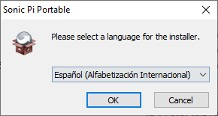
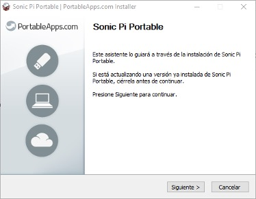
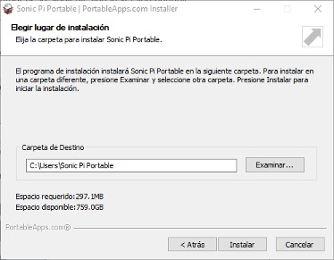
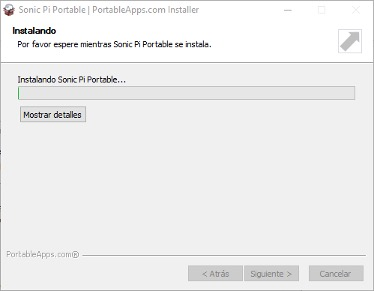
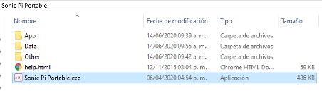
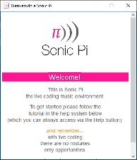
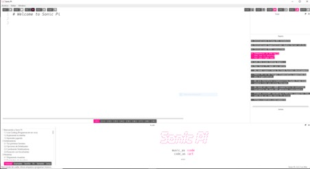
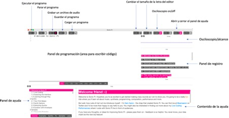

# Programación de Música con Sonic Pi

Sonic Pi es una herramienta de creación e interpretación musical basada en código.
En este taller aprenderemos a programar mientras componemos e interpretamos melodías y canciones con diferentes estilos de música.

## Requisitos

* Computadora
* Conexión a internet
* Asegurate de que tu computadora tenga bocinas integradas y funcionan correctamente.

## Introducción

Sonic Pi es una herramienta de creación e interpretación musical basada en código. Fue originalmente creada en el Laboratorio de Computación de la Universidad de Cambridge por Sam Aaron.

## Instalación de Sonic Pi

1. Descarga Sonic Pi dependiendo de tu sistema operativo [Windows version portable](https://sonic-pi.net/files/releases/v3.2.2/sonic-pi-for-win-x64-portable-v3.2.2.paf.exe) o [macOS](https://sonic-pi.net/files/releases/v3.2.2/sonic-pi-for-mac-v3.2.2.zip). En los siguientes pasos describiremos como ejecutar Sonic Pi desde Windows.

2. Abre el archivo descargado en el paso 1

3. Selecciona el lenguaje **Español** y da clic en el botón *OK* 

    

4. A continuación iniciara el asistente de instalación, da clic en el botón *Siguiente*

    

5. Selecciona en que directorio quieres instalar Sonic Pi y da clic en el botón *Instalar*

    

6. A continuacion veras el inicio, progreso y finalización de la instalación
    

## Iniciar Sonic Pi
1. Ingresa al directorio seleccionado en el paso 5 de la seccion de Instalar Sonic Pi

    

2. Abre Sonic Pi dando clic en el archivo *Sonic Pi Portable.exe*. A continuación veras se abrira una nueva ventana con la Bienvenida a Sonic Pi

    

3. A continuación, automaticamente se abrira la interfaz de Sonic Pi

    

## La interfaz de Sonic Pi

La interfaz de Sonic Pi cuenta con diferentes funcionalidades y botones que sirven para diferentes propositos entre los cuales encontraras: crear, guardar y ejecutar musica. Usa la siguiente imagen como una guia para familiarizarte con cada sección de Sonic Pi.

 

