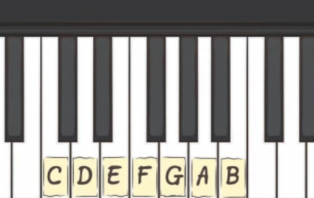
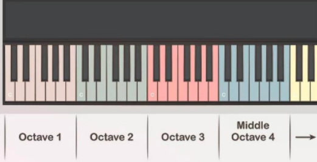

# Introducción

## Notas en el teclado :musical_keyboard:
El orden de la escala de notas musicales :notes: :notes: es _**do**, **re**, **mi**, **fa**, **sol**, **la**, y **si**_, y el mismo patrón se repite en el :musical_keyboard: teclado después de la nota _**si**_. Las :musical_keyboard: teclas representan cada una, una nota que identificaremos de la siguiente manera: 
C = do

D = re 

E = mi

F = fa 

G = sol 

A = la 

B = si



## Octavas del teclado :musical_keyboard:
En dirección de izquierda a derecha, a cada grupo de notas comprendidas entre do y se le llama  octava. Un piano estándar de 88 teclas tendrá 12,5 octavas. Una nota determinará la tonalidad de  una tecla, mientras que la octava determinará su frecuencia. Las notas de la izquierda tienen una  frecuencia más grave, mientras que las notas de la derecha tendrán una más alta. Casi siempre se  empieza a tocar una canción desde la nota do central, el cual es un término que utiliza para describir  la octava ubicada justo en el centro del piano.



Los ejercicios que realizaremos utilizaran el valor de las octavas en formato MIDI, la equivalencia de las notas de la 4ta octava son:

Notas  | Valor MIDI
------ | ----------
 C D E F G A B | 60 62 64 65 67 69 71 

MIDI = Musical Instrument Digital Interface. Refiere a un protocolo estándar de comunicaciones, es decir, es una forma en la que la computadora puede traducir números (que son los que procesa el Sonic Pi y a su vez la computadora) en notas musicales o sonido.


# Crea tu primera melodía

Una melodía es una secuencia de notas musicales, puedes crear tu primera melodia :musical_note: :musical_note: :musical_note: con el siguiente código:
```
play 60
sleep 1
play 67
sleep 1
play 69
sleep 1
```
Ahora agrega mas tonos a tu melodía y experimenta con diferentes notas
```
play 60
sleep 1
play 62
sleep 1
play 63
sleep 1
play 64
sleep 1
play 65
sleep 1
play 66
sleep 1
play 67
sleep 1
play 68
sleep 1
play 69
sleep 1
play 70
sleep 1
play 71
sleep 1
play 72
```
# Agrega efectos de sonido

Sonic Pi tiene diferentes sintetizadores, los cuales puedes utilizar para modificar el sonido de tu melodía.
```
use_synth :mod_beep
use_synth :piano
```

# Utiliza repeticiones
Ahora que ya sabes como crear una melodia, ¿qué pasaria si quieres repetir varias veces las mismas notas? Para evitar repetir el codigo una y mil veces, existen las iteraciones, la cual sirve para repetir muchas veces un bloque de código.
```
use_bpm 120 

5.times do 
  play 72
  sleep 1 
  play 74
  sleep 1
  play 76
  sleep 1
  play 77
  sleep 1
  play 79
  sleep 1
  play 81
  sleep 1
  play 83
  sleep 1
end
```

# Toca en vivo
Para modificar tus melodias sin detener la música o tocar en vivo utiliza ```live_loop``` y modifica el código sin detener la ejecución de la canción.
